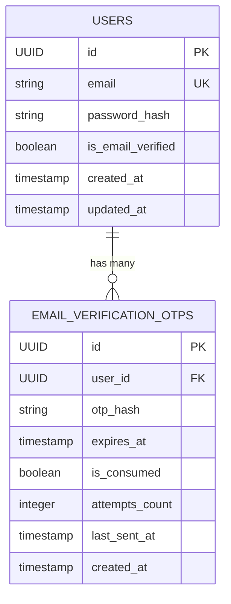
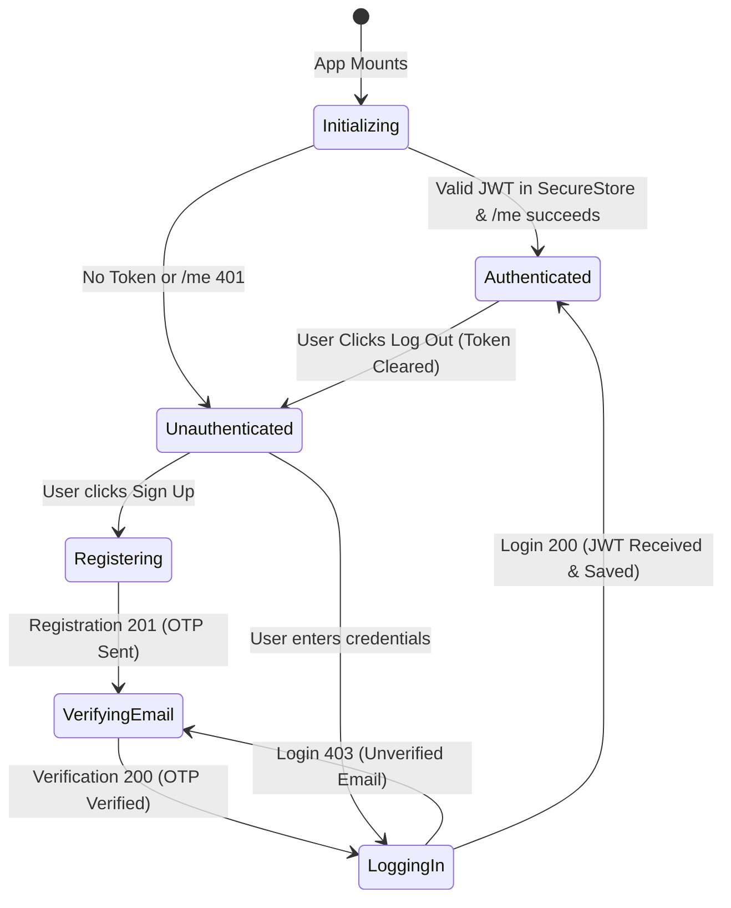
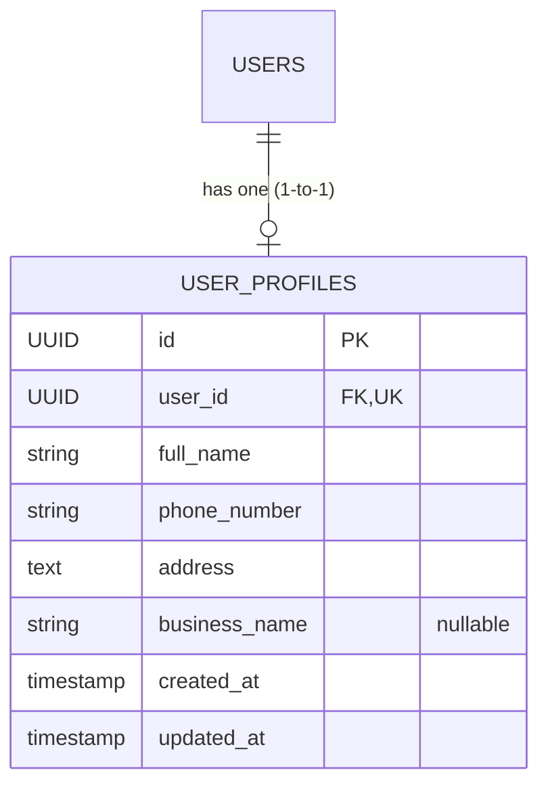

# PadosiPro Design Reference System

> **Notice:** The design tokens and layout conventions documented here are **visual reference values** observed from the public PadosiPro website for aesthetic alignment. They are not proprietary source code or production assets. All components, styling systems, and business implementations in this repository are original and purpose-built for the PadosiPro Full-Stack Assignment.

---

## 1. Visual Language & Principles

- **Clean & Professional:** A calm, trustworthy aesthetic designed for service professionals and clients.
- **Restrained Color Palette:** Deep forest green primary actions set against neutral whites and warm off-white canvas.
- **Spacious Hierarchy:** Comfortable vertical rhythm, distinct visual grouping, and generous whitespace.
- **Soft Geometry:** A consistent `12px` border radius on interactive elements, cards, and input fields.
- **Surface Elevation:** Subtle borders and minimal elevation to distinguish cards and modals from the canvas.

---

## 2. Color Palette Tokens

| Token Name | Hex Value | Usage / Description |
| :--- | :--- | :--- |
| `primary` | `#155C49` | Primary action buttons, active states, key interactive highlights |
| `primaryHover` | `#104738` | Hover / pressed state for primary actions |
| `primaryLight` | `#E8F2EE` | Soft tint for selected chips, badge backgrounds, and subtle accents |
| `textPrimary` | `#101828` | Main headings, primary body copy, titles |
| `textSecondary` | `#667085` | Subheadings, placeholder text, secondary metadata, captions |
| `background` | `#FAFAF7` | Overall application canvas / viewport background |
| `surface` | `#FFFFFF` | Card surfaces, modal sheets, input backgrounds, navigation bars |
| `border` | `#E4E7EC` | Hairline dividers, card outlines, input field borders |
| `borderFocus` | `#155C49` | Focused input border |
| `error` | `#D92D20` | Form validation errors, destructive actions, alert toasts |
| `errorLight` | `#FEF3F2` | Error banner/callout background |
| `success` | `#079455` | Confirmation states, success badges, checkmarks |
| `successLight` | `#ECFDF3` | Success banner background |

---

## 3. Typography Tokens

The reference design pairs a distinctive display heading style with an accessible system font stack for crisp legibility across mobile platforms.

| Typography Role | Size | Line Height | Weight | Reference Family / Fallback |
| :--- | :--- | :--- | :--- | :--- |
| **Heading 1 (H1)** | `30px` | `38px` | `700` (Bold / SemiBold) | `Eina01-SemiBold`, System Sans-Serif |
| **Heading 2 (H2)** | `24px` | `32px` | `600` (SemiBold) | System Sans-Serif |
| **Heading 3 (H3)** | `20px` | `28px` | `600` (SemiBold) | System Sans-Serif |
| **Subheading** | `18px` | `26px` | `500` (Medium) | System Sans-Serif |
| **Body Default** | `16px` | `24px` | `400` (Regular) | System Sans-Serif |
| **Body Medium** | `16px` | `24px` | `500` (Medium) | System Sans-Serif |
| **Body Small** | `14px` | `20px` | `400` (Regular) | System Sans-Serif |
| **Metadata / Label** | `12px` | `16px` | `500` (Medium) | System Sans-Serif |
| **Caption** | `11px` | `14px` | `400` (Regular) | System Sans-Serif |

---

## 4. Layout & Spacing Tokens

A base unit of `4px` with standard multiples:

| Token | Size | Common Application |
| :--- | :--- | :--- |
| `space.xs` | `4px` | Badge padding, micro spacing |
| `space.sm` | `8px` | Inner gap between icon and text |
| `space.md` | `12px` | Compact button padding, card inner margins |
| `space.lg` | `16px` | Standard screen horizontal padding, form field gaps |
| `space.xl` | `20px` | Section margins |
| `space.2xl` | `24px` | Container padding, modal header spacing |
| `space.3xl` | `32px` | Major section breaks |
| `space.4xl` | `40px` | Screen top/bottom gutters |

---

## 5. Shape & Corner Radii

| Token | Radius | Usage |
| :--- | :--- | :--- |
| `radius.sm` | `6px` | Small badges, tags |
| `radius.md` | `8px` | Small buttons, chip items |
| `radius.lg` | `12px` | Standard interactive buttons, text inputs, card containers |
| `radius.xl` | `16px` | Floating cards, modal sheets |
| `radius.full` | `9999px` | Avatars, circular icon buttons, pills |

---

## 6. Component Guidelines

- **Primary Buttons:** High-contrast background (`#155C49`) with pure white text (`#FFFFFF`), `12px` corner radius, `16px` vertical hit area (minimum 48px touch target).
- **Form Inputs:** Bordered with `#E4E7EC`, white background (`#FFFFFF`), text `#101828`, placeholder `#667085`, `12px` radius.
- **Cards & Surfaces:** Off-white page background (`#FAFAF7`) with white card surfaces (`#FFFFFF`) bounded by a subtle `1px` border (`#E4E7EC`) or light shadow.
- **Status States:** Every interactive flow must clearly indicate loading (spinners/skeletons), empty lists (helpful guidance and illustrations), and error feedback (clear inline error text or toast notifications).

---

## 7. Backend Authentication Architecture (Phase 2)

### 7.1 Architecture & Security Decisions

| Decision | Selection | Rationale (Interview-Friendly) |
| :--- | :--- | :--- |
| **Password Hashing** | **Argon2id** (`argon2-cffi`) | Winner of the Password Hashing Competition (PHC). Provides superior resistance against GPU/ASIC-based attacks compared to standard legacy hashing algorithms. |
| **OTP Generation** | `secrets.randbelow(900000) + 100000` | Cryptographically secure pseudo-random number generator (CSPRNG) from the OS entropy source. Guarantees uniform distribution across `100000`–`999999`. |
| **OTP Storage** | **HMAC-SHA256 with Server Salt** | Since a 6-digit number has only $10^6$ combinations, unsalted hashes can be reverse-looked-up in seconds via rainbow tables. A secret server-side key HMAC prevents offline enumeration attacks if database tables are leaked. |
| **OTP Comparison** | `hmac.compare_digest` | Constant-time string comparison protects against remote timing side-channel attacks. |
| **Token Authentication** | **Stateless JWT (HS256)** | Scalable, standard bearer authentication token with expiration (`exp`), subject UUID (`sub`), and issued-at (`iat`) metadata. |
| **Email Relay** | **Mailpit SMTP & Web Inspector** | Local development SMTP server running in Docker, allowing real inspection of email formatting and OTP codes without third-party email deliverability dependencies. |

### 7.2 Database Entity Relationships

### 7.3 OTP Lifecycle & State Machine

1. **Registration / Resend Trigger:**
   - Pre-existing active OTPs for the user are invalidated (`is_consumed = True`).
   - A new 6-digit random code is generated.
   - The code is hashed using HMAC-SHA256 with the secret salt.
   - `last_sent_at` and `expires_at` (10 minutes) are recorded.
   - The plain code is dispatched via Mailpit SMTP; the plain code is **never persisted**.
2. **Resend Cooldown Guard:**
   - A ~30-second cooldown is verified against `last_sent_at`. If requested within 30 seconds, HTTP 429 is returned with the remaining seconds.
3. **Verification Attempt:**
   - The active unconsumed record is fetched.
   - If `now > expires_at`: rejected with HTTP 400 (code expired).
   - If `attempts_count >= 5`: code is marked consumed and rejected with HTTP 400 (attempt limit reached).
   - If hash matches: `is_consumed = True` and user `is_email_verified = True`.
   - If hash mismatches: `attempts_count` is incremented. If count hits 5, the code is permanently invalidated.

### 7.4 JWT Authentication Flow

1. User submits `email` and `password` to `POST /api/v1/auth/login`.
2. Password is verified against the stored Argon2id hash using constant-time verification.
3. Email verification flag (`is_email_verified`) is checked. Unverified accounts receive **HTTP 403 Forbidden**.
4. A signed JWT bearer token containing `sub: <user_id>` is issued with a 24-hour expiration window.
5. Client submits token via `Authorization: Bearer <token>` to access protected endpoints (e.g., `GET /api/v1/auth/me`).

---

## 8. Mobile Authentication Architecture (Phase 3)

### 8.1 Technology & Security Decisions

| Decision | Selection | Rationale |
| :--- | :--- | :--- |
| **Token Storage** | `expo-secure-store` | Hardware-backed keystore (Android Keystore / iOS Keychain). Prevents XSS / file-system extraction of JWT bearer tokens (AsyncStorage is strictly avoided). |
| **State Management** | Native React Context (`AuthContext`) | Clean, zero-boilerplate session state without heavy external dependencies. Easily mockable and explainable in interviews. |
| **Route Protection** | Expo Router `NavigationGuard` | Evaluates auth state and active route segments. Renders a neutral splash during token verification to eliminate protected screen flashing. |
| **Network Configuration** | Dynamic `API_BASE_URL` | Seamlessly selects `10.0.2.2` for Android Emulator, `localhost` for iOS simulator, or `EXPO_PUBLIC_API_URL` for physical devices over Wi-Fi. |

### 8.2 Client State Machine

### 8.3 Screen Design & UX Principles

- **Registration Screen:** Form inputs designed with 56px height, soft 12px border radius, clear labels, and password toggles. Validates passwords before submission and displays actionable backend error alerts.
- **OTP Verification Screen:** Prominently displays the recipient email, provides a styled 6-digit numeric input with monospace typography, and includes an active 30-second countdown timer for resending codes.
- **Login Screen:** Provides fast authentication, detects unverified accounts (HTTP 403), and provides an instant one-tap shortcut to the email verification screen with the email prefilled.
- **Protected Home Landing:** Confirms verified session, displays user email and ID, and provides a clear logout mechanism.

---

## 9. First-Login Profile Architecture (Phase 4)

### 9.1 Data Model & Entity Relationship

### 9.2 Key Design & Architectural Decisions

| Decision | Selection | Rationale (Assignment-Mandated Justification) |
| :--- | :--- | :--- |
| **Business Name: Optional** | `Optional[str] = None` | **Why Optional:** PadosiPro serves both registered home-service agencies and independent, solo lifestyle managers/handymen. Forcing solo professionals to enter an artificial business name creates unnecessary onboarding friction and falsified data. Leaving it optional accommodates individual professionals while allowing formal agencies to brand themselves. |
| **Phone Number Validation** | Indian format: `+91` with 10 digits starting with `6–9` | Matches the Indian operational focus (`+91`). Accepts common variations (`9876543210`, `+91 98765 43210`, `+91-98765-43210`) and normalizes strictly to E.164 `+91XXXXXXXXXX`. |
| **"Shown Once" Enforcement** | Server-backed `has_profile` + Route Guard | The user model evaluates profile existence. The mobile `NavigationGuard` detects `has_profile === false` and routes immediately to `/(onboarding)/profile`. Once saved, the session refreshes, and returning users bypass onboarding directly to the application dashboard. |
| **1-to-1 Constraint** | Unique index on `user_profiles.user_id` | Database-level unique constraint prevents duplicate profile creation attempts (`HTTP 409 Conflict`). Updates are routed through `PUT /api/v1/profile`. |

